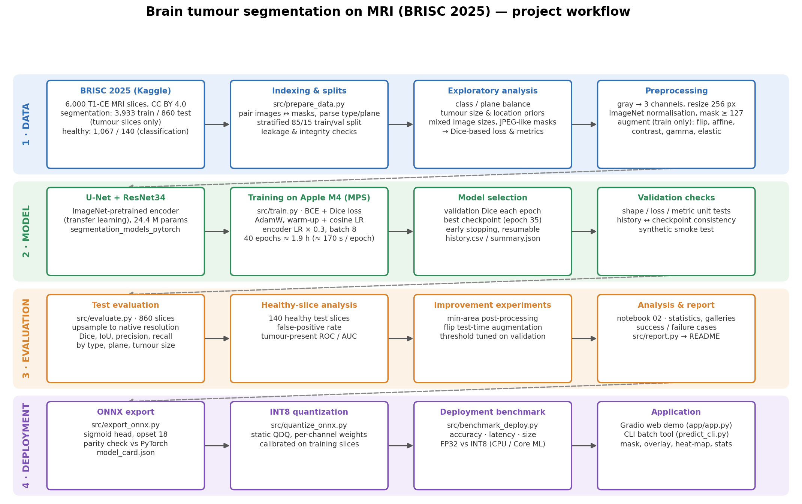
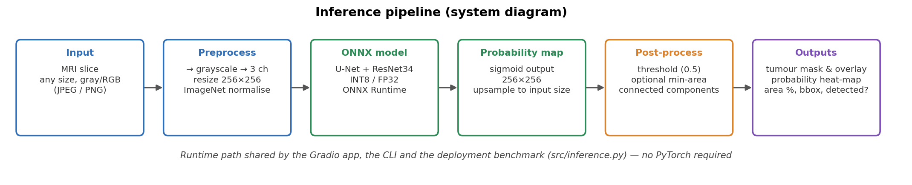
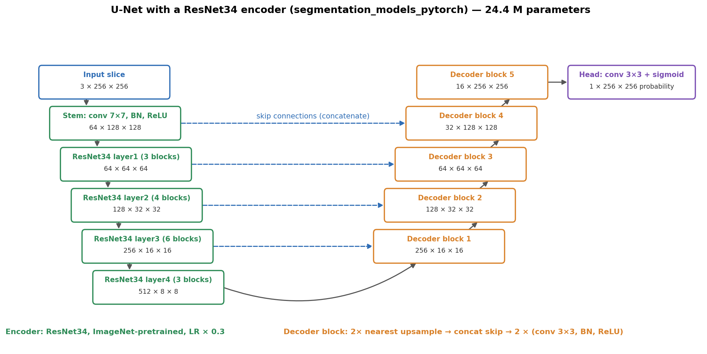
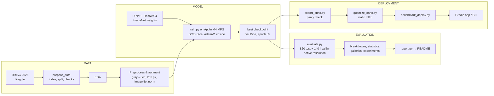
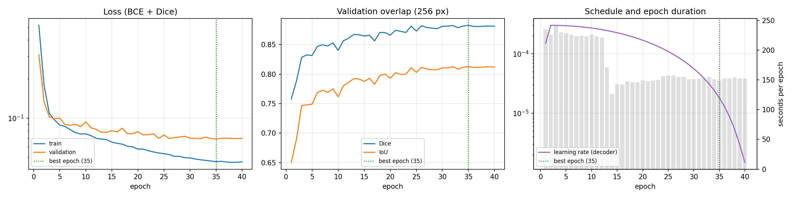
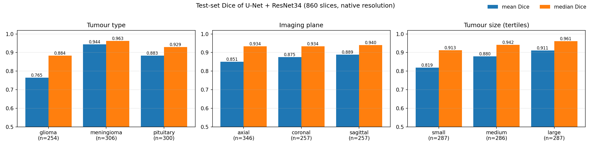

# 🧠 Brain Tumour Segmentation on MRI — U-Net + ResNet34 (BRISC 2025)

**SDAIA Academy · Computer Vision Systems Development · Final Project**

Pixel-level segmentation of brain tumours (glioma, meningioma, pituitary) in T1-weighted contrast-enhanced MRI slices, trained and deployed entirely on a MacBook Air (Apple M4, 16 GB).

> ⚠️ **Educational prototype. Not a medical device and not intended for diagnosis.**

| | |
|---|---|
| **Task** | Semantic segmentation (binary: tumour vs. background) |
| **Model** | U-Net with an ImageNet-pretrained ResNet34 encoder (transfer learning, 24.4 M parameters) |
| **Data** | BRISC 2025 — 4,793 expert-annotated tumour slices + 1,207 healthy slices |
| **Test result** | **Dice 0.870** (median 0.937) · IoU 0.801 on 860 held-out slices |
| **Deployment** | ONNX export → static INT8 quantization → Gradio web app & CLI (ONNX Runtime, no PyTorch needed) |

---

## Table of contents

1. [Project Overview](#1-project-overview)
2. [Problem Description](#2-problem-description)
3. [Dataset & Model Used](#3-dataset--model-used)
4. [Workflow / Architecture](#4-workflow--architecture)
5. [Results & Evaluation](#5-results--evaluation)
6. [Technologies Used](#6-technologies-used)
7. [How to Run the Project](#7-how-to-run-the-project)
8. [Future Improvements](#8-future-improvements)
9. [SDAIA Academy GitHub Repository Link](#9-sdaia-academy-github-repository-link)

---

## 1. Project Overview

This project builds a complete computer-vision system that takes a single brain MRI slice and returns the
region occupied by a tumour. It covers every stage of a real CV project:

* **Data engineering** — automatic indexing of the Kaggle archive, stratified validation split,
  integrity and leakage checks, exploratory analysis.
* **Modelling** — U-Net segmentation with a pretrained ResNet34 encoder, fine-tuned with a BCE + Dice loss
  on the Apple GPU (Metal / MPS).
* **Evaluation** — Dice, IoU, precision and recall at native image resolution, broken down by tumour type,
  imaging plane and tumour size; false-positive analysis on healthy slices; statistical analysis;
  success and failure cases; inference-time improvement experiments.
* **Deployment & optimisation** — ONNX export verified against PyTorch, static INT8 quantization,
  accuracy/latency benchmark, and a local web application.

The configuration files for three further variants (U-Net from scratch, U-Net + EfficientNet-B0, and
U-Net + ResNet34 trained with healthy slices) are included and runnable, but this submission reports the
ResNet34 model only (see [Future Improvements](#8-future-improvements)).

## 2. Problem Description

Brain tumours must be located and measured on MRI for diagnosis, surgical planning and follow-up.
Outlining a tumour by hand is slow and varies between readers, and the three most common tumour types look
very different: meningiomas are usually compact with sharp borders, pituitary tumours sit in a small
anatomical region at the skull base, and gliomas grow into surrounding tissue with blurred, irregular margins.

**Purpose of the system:** to automatically highlight the suspected tumour region on a 2D MRI slice so that a
reviewer can see *where* and *how large* it is — a decision-support and teaching tool, not a diagnostic one.

**Input:** one T1-weighted contrast-enhanced brain MRI slice (axial, coronal or sagittal; any size; JPEG/PNG).

**Expected output:**

* a binary **tumour mask** at the input resolution, and an overlay on the slice,
* a pixel-wise **tumour probability map**,
* measurements: tumour area (pixels and % of the slice), number of regions, bounding box,
  maximum / mean probability, and a *tumour detected* flag (largest region ≥ 50 px).

Because tumours cover only ~1 % of a slice (median), pixel accuracy is meaningless (predicting "no tumour"
everywhere is already > 98 % accurate). The system is therefore trained with a Dice-based loss and judged with
overlap metrics (Dice, IoU).

## 3. Dataset & Model Used

### Dataset — BRISC 2025

* Source: [Kaggle: briscdataset/brisc2025](https://www.kaggle.com/datasets/briscdataset/brisc2025) ·
  paper: [arXiv:2506.14318](https://arxiv.org/abs/2506.14318) · licence **CC BY 4.0**.
* 6,000 T1-weighted contrast-enhanced MRI slices annotated by radiologists and physicians, in three planes.
* The **segmentation task contains tumour slices only**; healthy slices (`no_tumor`) exist only in the
  classification task. Both were used:

| Split | Glioma | Meningioma | Pituitary | Total tumour slices | Healthy slices | Use |
|---|---:|---:|---:|---:|---:|---|
| train | 975 | 1,130 | 1,238 | 3,343 | 1,067 | training |
| val (15 %, stratified by type × plane) | 172 | 199 | 219 | 590 | — | model selection |
| test (official) | 254 | 306 | 300 | 860 | 140 | final evaluation only |

| Plane | train | val | test |
|---|---:|---:|---:|
| axial | 1,057 | 186 | 346 |
| coronal | 1,160 | 206 | 257 |
| sagittal | 1,126 | 198 | 257 |

**Data preparation** (`src/prepare_data.py`, `notebooks/02`):

* image/mask pairs matched by file name; tumour type and plane parsed from the file name
  (`..._gl_ax_...` → glioma, axial) — 100 % parsed;
* fixed, reproducible split CSVs in `data/splits/` (committed);
* checks: expected sizes, no shared files between splits, all files present, perceptual-hash
  near-duplicate search between training and test slices;
* **findings:** image sizes are *not* uniform (e.g. 512×512, 446×450, 216×224; some single-channel) and the
  masks contain compression-like grey values (0–8 and 248–252). The pipeline therefore resizes every slice,
  binarises masks at 127, and scores predictions at each slice's own resolution.

**Preprocessing:** grayscale → 3 identical channels (to reuse ImageNet weights) → resize to 256×256 →
ImageNet mean/std normalisation. **Augmentation** (training only, Albumentations): horizontal flip,
affine (±15°, ±10 % scale, ±5 % shift), brightness/contrast, gamma, mild elastic deformation.

### Model — U-Net with a pretrained ResNet34 encoder

* **U-Net** is the standard architecture for biomedical segmentation: an encoder extracts features at
  decreasing resolution, a decoder upsamples them back, and **skip connections** carry fine spatial detail
  across — essential for accurate tumour boundaries.
* The encoder is a **ResNet34 pretrained on ImageNet** (`segmentation_models_pytorch`), i.e. transfer learning:
  generic edge/texture features speed up training and help with only ~3,300 training slices.
  It is fine-tuned with a 0.3× learning rate so the pretrained features are adapted gently.
* 24.4 M parameters; output: one logit per pixel → sigmoid probability.

**Training setup:** BCE + Dice loss (0.5/0.5) · AdamW (lr 3e-4, weight decay 1e-4) · 1 warm-up epoch +
cosine decay · gradient clipping 1.0 · batch 8 · 40 epochs · best checkpoint by validation Dice ·
Apple M4 GPU (MPS), ≈ 116 min in total.

## 4. Workflow / Architecture







<details><summary>Workflow as a Mermaid diagram</summary>



</details>

## 5. Results & Evaluation

All numbers are for the held-out **test set**, which was used neither for training nor for choosing the
checkpoint. Predictions are made at 256 px and upsampled to each slice's native size before scoring.
Metrics: **Dice** = 2·|P∩G| / (|P|+|G|), **IoU** = |P∩G| / |P∪G|, **precision** = share of the predicted region
that is tumour, **recall** = share of the tumour that was found.

<!-- RESULTS:START -->
### Training

| Parameters | Epochs | Best epoch | Best val Dice | Val IoU @best | Training time |
| --- | --- | --- | --- | --- | --- |
| 24.4 M | 40 | 35 | 0.883 | 0.813 | 116 min (mps) |



### Test set (860 tumour slices, never used for training or model selection)

| Dice (mean) | Dice (median) | IoU | Precision | Recall | Global Dice |
| --- | --- | --- | --- | --- | --- |
| 0.870 | 0.937 | 0.801 | 0.872 | 0.892 | 0.893 |

*Global Dice pools all pixels of the test set; the other scores are averaged per slice.*



| Tumour type | n | Dice (mean) | Dice (median) | IoU | Precision | Recall |
| --- | --- | --- | --- | --- | --- | --- |
| glioma | 254 | 0.765 | 0.884 | 0.677 | 0.793 | 0.778 |
| meningioma | 306 | 0.944 | 0.963 | 0.900 | 0.951 | 0.944 |
| pituitary | 300 | 0.883 | 0.929 | 0.807 | 0.860 | 0.935 |

| Plane | n | Dice (mean) | Dice (median) | IoU | Precision | Recall |
| --- | --- | --- | --- | --- | --- | --- |
| axial | 346 | 0.851 | 0.934 | 0.784 | 0.852 | 0.879 |
| coronal | 257 | 0.875 | 0.934 | 0.805 | 0.877 | 0.896 |
| sagittal | 257 | 0.889 | 0.940 | 0.822 | 0.894 | 0.905 |

| Size (tertile of slice area) | n | Dice (mean) | Dice (median) | IoU | Precision | Recall |
| --- | --- | --- | --- | --- | --- | --- |
| small (0.08–0.81 %) | 287 | 0.819 | 0.913 | 0.736 | 0.795 | 0.883 |
| medium (0.81–1.88 %) | 286 | 0.880 | 0.942 | 0.813 | 0.885 | 0.893 |
| large (1.88–15.5 %) | 287 | 0.911 | 0.961 | 0.856 | 0.937 | 0.901 |

### Healthy slices (false positives)

The segmentation split contains tumour slices only, so the model was never shown a healthy brain.
On the 140 healthy test slices it predicts a region of:

| ≥ 1 px | ≥ 50 px | ≥ 200 px |
| --- | --- | --- |
| 71.4 % | 67.1 % | 60.7 % |

### Speed

7.0 ms per slice on the Apple M4 GPU (PyTorch, batch 16).

*Run `python -m src.report` to refresh this section with the improvement experiments, the deployment benchmark
and the qualitative galleries.*
<!-- RESULTS:END -->

### Failure analysis

The breakdowns above point to four systematic failure modes (examples: `assets/gallery_worst.png`,
`assets/gallery_healthy_fp.png`, and the cross-model / hardest-case figures in `notebooks/02`):

1. **Gliomas (Dice 0.765 vs 0.944 for meningiomas).** Both precision (0.793) and recall (0.778) are low:
   the model misses parts of the tumour *and* includes surrounding tissue. Gliomas infiltrate the brain with
   diffuse, irregular margins and heterogeneous enhancement, so the boundary itself is ambiguous.
   The large gap between mean (0.765) and median (0.884) shows that most gliomas are segmented well and a
   minority fail badly (partial or complete misses).
2. **Small tumours (Dice 0.819).** Precision drops to 0.795: a few wrongly predicted pixels weigh heavily
   against a small true area, and downsampling 512 → 256 px blurs small lesions before the network sees them.
3. **Pituitary over-segmentation.** Recall (0.935) is much higher than precision (0.860): the model tends to
   extend the region into neighbouring enhancing structures around the sella.
4. **Healthy slices.** The model finds a "tumour" on about two thirds of healthy slices, often a large region.
   It was trained only on slices that always contain a tumour, so it learned that prior. In a real application
   this is the most important limitation; post-processing does not solve it (see the improvement experiments),
   while training with healthy slices is expected to (see Future Improvements).

Axial slices are slightly harder (0.851) than coronal (0.875) and sagittal (0.889) ones, and the
validation → test drop is small (0.883 → 0.870), so the checkpoint selection did not over-fit the validation set.

### Deployment / optimisation

The model is exported to **ONNX** (with the sigmoid included) and checked against PyTorch on real test slices,
then **statically quantized to INT8** (QDQ, per-channel weights, calibrated on training slices only).
`src/benchmark_deploy.py` compares accuracy, false positives, latency and file size of PyTorch, ONNX FP32 and
ONNX INT8 (results in the Results section after running the report).

The **Gradio app** (`app/app.py`) runs the INT8 model locally with ONNX Runtime: upload a slice → overlay,
probability map and measurements, with adjustable threshold and minimum region size. `app/predict_cli.py`
does the same for batches of files. Neither needs PyTorch or a GPU.

## 6. Technologies Used

| Area | Tools |
|---|---|
| Language & environment | Python 3.12, Conda, Jupyter |
| Deep learning | PyTorch 2.14 (Apple **MPS** backend), segmentation-models-pytorch 0.5, timm 1.0 |
| Data & augmentation | Albumentations 2.0, OpenCV 5.0, NumPy, pandas, Kaggle CLI |
| Evaluation & analysis | scikit-learn (split, ROC/AUC), SciPy (Wilcoxon test), Matplotlib |
| Deployment & optimisation | ONNX 1.22, ONNX Runtime 1.30 (static INT8 quantization, CPU / Core ML providers) |
| Application | Gradio 6 |
| Hardware | MacBook Air, Apple M4 (10-core CPU / 10-core GPU), 16 GB unified memory — no cloud |

## 7. How to Run the Project

All commands run from the project root on macOS (Apple Silicon). Steps whose outputs already exist can be skipped.

```bash
# 0) Environment
conda env create -f environment.yml
conda activate brisc-seg
python scripts/check_env.py                       # versions + MPS benchmark
python -m ipykernel install --user --name brisc-seg --display-name "Python (brisc-seg)"

# 1) Data (Kaggle API token needed — or download the zip manually into data/raw/)
bash scripts/download_data.sh
python -m src.prepare_data                        # writes data/splits/*.csv

# 2) Optional smoke test on synthetic data (~1 min)
python scripts/make_synthetic_data.py
python -m src.prepare_data --data-root data/synthetic --out data/splits_synthetic
python -m src.train --config configs/unet_scratch.yaml --smoke \
    --data-root data/synthetic --splits-dir data/splits_synthetic

# 3) Train (≈ 2 h on an M4; resumable with --resume)
python -m src.train --config configs/unet_resnet34.yaml

# 4) Evaluate on the test set + inference-time experiments
python -m src.evaluate --run runs/unet_resnet34
python -m src.evaluate --run runs/unet_resnet34 --min-area 200
python -m src.evaluate --run runs/unet_resnet34 --tta
python -m src.evaluate --run runs/unet_resnet34 --tta --min-area 200

# 5) Full analysis notebook (validation checks, statistics, threshold tuning, figures)
jupyter notebook notebooks/02_full_pipeline_and_analysis.ipynb

# 6) Deployment
python -m src.export_onnx --run runs/unet_resnet34     # models/unet_resnet34_fp32.onnx + parity check
python -m src.quantize_onnx                            # models/unet_resnet34_int8.onnx
python -m src.benchmark_deploy --coreml                # assets/deployment_benchmark.*
python scripts/prepare_app_examples.py                 # a few test slices for the demo
python app/app.py                                      # open http://127.0.0.1:7860
python app/predict_cli.py app/examples/*.jpg --out outputs/predictions

# 7) Figures and README results
python scripts/make_diagrams.py
python -m src.report
```

The trained INT8 model is included in `models/`, so the app (step 6, last three commands) works directly
after cloning and installing the requirements.

### Repository structure

```
├── app/                    Gradio demo (app.py), CLI (predict_cli.py), example slices
├── assets/                 diagrams, figures, result tables used in this README
├── configs/                one YAML per model variant
├── data/splits/            reproducible split CSVs + summary (raw data is not committed)
├── models/                 INT8 ONNX model + model_card.json
├── notebooks/
│   ├── 01_data_exploration.ipynb
│   └── 02_full_pipeline_and_analysis.ipynb   ← complete, executed pipeline & analysis
├── scripts/                data download, environment check, diagrams, synthetic data, app examples
└── src/
    ├── prepare_data.py  data_index.py  dataset.py  transforms.py      data pipeline
    ├── models.py  losses.py  metrics.py  train.py                     training
    ├── evaluate.py  analysis.py  compare_runs.py  report.py           evaluation & reporting
    └── export_onnx.py  quantize_onnx.py  inference.py  benchmark_deploy.py   deployment
```

## 8. Future Improvements

1. **Train with healthy slices** (highest priority). The model flags a tumour on ~67 % of healthy slices
   because the segmentation data only contains tumours. Adding the 1,067 healthy training slices with empty
   masks (ready to run: `configs/unet_resnet34_healthy.yaml`, validation then also rewards empty predictions)
   should cut false positives sharply. Alternatives: a slice-level classification gate or a multi-task
   classification + segmentation head using BRISC's class labels.
2. **Better gliomas and small tumours:** train at 384–512 px or on tumour-centred crops; boundary-aware or
   Focal-Tversky losses; deeper supervision.
3. **Architecture comparison:** the included configs for a from-scratch U-Net (`unet_scratch.yaml`) and a
   lightweight EfficientNet-B0 U-Net (`unet_effb0.yaml`) quantify the value of transfer learning and the
   accuracy/speed trade-off; U-Net++ or transformer encoders are further candidates.
4. **More robust estimates:** 5-fold cross-validation, ensembling, and calibrated probabilities / uncertainty maps.
5. **External validation** on other scanners and datasets before any claim of generalisation; 3D context
   is not available in single slices and would need volumetric data.
6. **Deployment:** Core ML conversion for on-device iPhone/iPad use, DICOM input support, and a hosted demo
   (e.g. Hugging Face Spaces).

## 9. SDAIA Academy GitHub Repository Link

**Repository:** `https://github.com/youldash/brisc-tumor-segmentation`

**SDAIA Academy GitHub:** `https://github.com/SDAIAAcademy`

---

### Acknowledgements & licence

* Dataset: BRISC 2025 (CC BY 4.0) — please cite the dataset paper (arXiv:2506.14318) when reusing the data.
  The example slices in `app/examples/` are unmodified images from its test set.
* Pretrained encoder weights: ImageNet via `segmentation_models_pytorch` / `timm`.
* Developed for the SDAIA Academy *Computer Vision Systems Development* programme.
